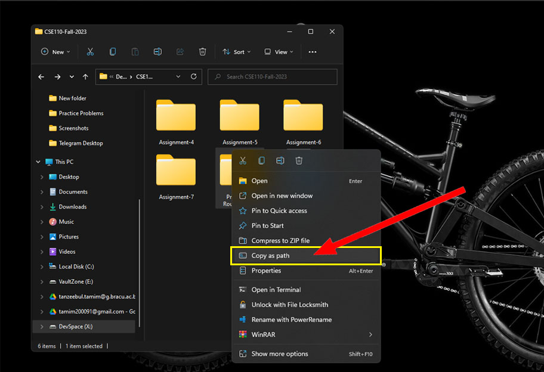
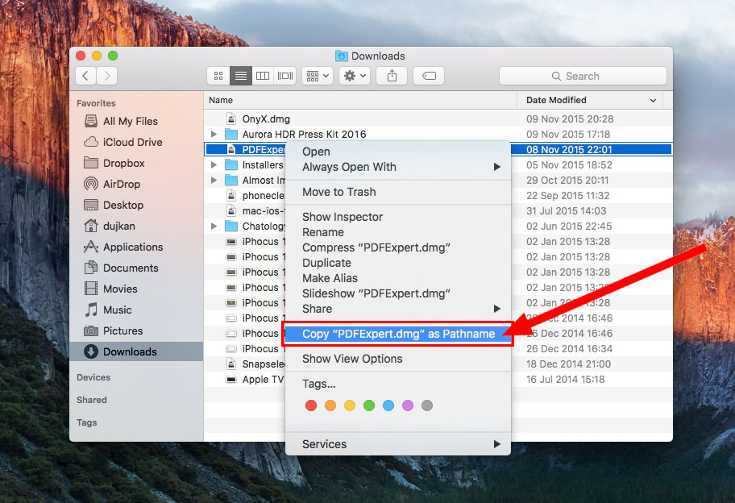
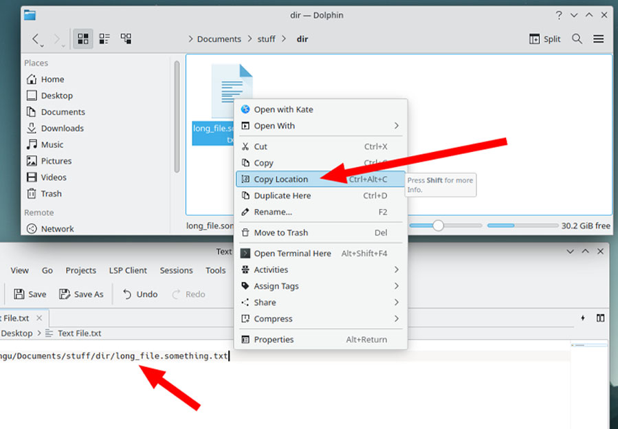

<h1 align=center>Assignment Compiler Project</h1>
<h4 align=center>Simplify your assignment compilation process and make your CSE111 submissions effortless!</h4>

---

<break></break>

Welcome to the **Assignment Compiler Project** repository! This project is mainly focused on BRACU's CSE111 Programming Language II course's assignment submission, to help us ease the task of copying and pasting numerous assignment files into one text file, which is the only valid and accepted format of assignment submission for this course.

This project provides a utility to compile multiple assignment files into a single `.txt` file with proper formatting, adhering to university submission requirements. The program is designed to save time, ensure consistency, and reduce manual errors.

## Table of Contents

- [Project Availability](#project-availability)
- [Used Packages and Technologies](#used-packages-and-technologies)
- [Prerequisites](#prerequisites)
- [Project Features](#project-features)
- [Installation](#installation)
- [Running the Program](#running-the-program)
- [Testing with Sample Files](#testing-with-sample-files)
- [Sample Output File Example](#sample-output-file-example)
- [Contributing](#contributing)
- [License](#license)

## Project Availability

This project is currently a local utility tool and does not have a live deployment. Follow the instructions in the [Installation](#installation) and [Running the Program](#running-the-program) sections to use it.

## Used Packages and Technologies

- **_Java_**: <br>

  - For the core implementation of the utility.
  - Utilized packages for file handling:
    - **_`java.io.File`_**: To handle file paths, check file existence, and create files or directories.
    - **_`java.util.Scanner`_**: For reading file contents and accepting user inputs during runtime.
    - **_`java.io.FileWriter` and `java.io.BufferedWriter`_**: For writing formatted outputs to a text file.
  - **_`java.util.concurrent.atomic.AtomicInteger`_**: For thread-safe counting of task numbers during file processing.

- **_OOP Design Patterns_**: <br>
  Encapsulated file handling and processing logic for clean and modular code.

- **_Command-Line Interface (CLI)_**: <br>
  Provides a simple interface to interact with the tool.

## Prerequisites

- **_JDK 11_** or higher
- A text editor or IDE (e.g., **_`IntelliJ IDEA`_**, **_`Eclipse`_**, **_`Visual Studio Code`_**)

<br>

---

<details>
<summary><h2 id="project-features">Project Features</h2></summary>

- **_File Compilation:_** <br>
  Combines multiple assignment files into a single `.txt` file with proper formatting. Each task is separated by comments like `// TASK 1`, `// TASK 2`.

- **_Input Flexibility:_** <br>
  The program allows you to specify which files to include in the compiled document.

- **_Automated Naming Convention:_** <br>
  Automatically names the output file using a standard format (`Assignment XX_Your-ID_Your-Name.txt`).

- **_File Type Support:_** <br>
  Supports multiple file extensions, including Java, Python, C, C++, HTML, CSS, JavaScript, TypeScript, and others. You can modify the supported file extensions directly in the code. The current supported extensions are:

  - js
  - ts
  - html
  - css
  - xml
  - txt
  - java
  - py
  - cpp
  - c
  - cs

- **_Subdirectory Handling:_** <br>
  The program can process files in subdirectories, making it easier to handle projects with complex folder structures. However, it is **highly recommended** to keep all files in the main/root directory of the provided path, as issues might occur if files are spread across multiple subdirectories.

- **_Automated Task Sequence Detection:_** <br>
  Automatically detects numbered task sequences (e.g., `Task 1`, `Task 2` or `task1`, `task2` or `Task-01`, `Task-02` etc.) from file names. If the sequence is not in order, you can manually input or reorder the tasks in the correct sequence.

- **_Manual Task Sequence Detection:_** <br>
  If the program fails to detect a proper sequence or if your files are not named consistently, you’ll be prompted to manually provide the correct sequence for each file. This ensures that the tasks are ordered correctly before generating the final output.

- **_Combining Multiple Files as One Task:_** <br>
  The program also allows you to combine multiple files into a single task in the generated output. If you have related files that should be considered part of the same task, you can group them together, and they will be treated as one task in the final document.

- **_Removing `package` Statements:_** <br>
  The program automatically detects and removes `package` statements from the top of Java files. If a `package` statement is present, it is excluded from the generated output, ensuring that the file content starts immediately from the next statement, with trailing blank lines removed for a clean format.

- **_Error Handling:_** <br>
  Validates input files to ensure they exist and are formatted correctly.

- **_Empty Directory Detection:_** <br>
  The program can detect and reject empty directories if provided, ensuring only valid directories containing files are processed.

- **_Handling Files with the Same Name:_** <br>
  If a file with the same name already exists in the directory, the program provides 3 options to the user:

  - **_Overwrite:_** Replace the existing file with the new one.
  - **_Create New Version:_** Generate a new version of the file with a suffix like `(1)`, `(2)`, etc., appended to its name.
  - **_Skip:_** Skip the current file writing operation entirely.

- **_Tailored for BRAC University:_** <br>
  Specifically designed to assist students in BRAC University's **CSE111 - Programming Language II** course. The utility simplifies the task of combining multiple assignment files into the `.txt` format, which is the only valid and accepted format for assignment submissions in this course.

- **_Future GUI Support:_** <br>
Plans for a graphical user interface to simplify the process further.
</details>

---

<details>
  <summary><h2 id="installation">Installation</h2></summary>

1. **_Clone the repository_:**

   ```sh
   git clone https://github.com/Tanzeebul-Tamim/Assignment-Compiler.git
   cd Assignment-Compiler
   ```

2. **_Create a `bin` directory to store compiled `.class` files_:**

   ```sh
   mkdir bin
   ```

3. **_Compile the Java source files_:**
   ```sh
   javac -d bin src/Main.java src/utilities/*.java
   ```
   </details>

---

<details>
  <summary><h2 id="running-the-program">Running the Program</h2></summary>

1.  **_Navigate to the `bin` directory_:**

    ```sh
    cd bin
    ```

2.  **_Run the program_:**

    ```sh
    java Main
    ```

3.  **_Follow the prompts_:** <br>

    When you run the program, you’ll be guided through several input steps. Here's what to expect:

    - **_Enter the Assignment Number_:** <br>
      You’ll be asked to input the assignment number, such as `3` for Assignment 03. The program supports assignment numbers ranging from `1` to `15`. Make sure to input a valid number within this range.

    - **_Enter Your ID_:** <br>
      You’ll then be prompted to enter your 8-digit student ID (e.g., `24100000`). The program verifies the ID to ensure a valid ID is provided.

    - **_Enter Your Name_:** <br>
      You’ll be then asked to input your name. The program automatically corrects improper naming conventions. For example, if you enter something like `tANzEEBuL       tAMiM    `, it will be converted to the proper format: `Tanzeebul Tamim`.

    - **_Enter the File Extension_:** <br>
      The program requires you to specify the desired file extension (e.g., `java`, `py`, `cpp`) to filter out unsupported or irrelevant files. It validates your input to ensure it matches one of the supported extensions and rejects any invalid or unsupported file types.

    - **_Enter the Path to Your Assignment Folder_:** <br>
      The program requires the folder path where your assignment files are stored. You can copy the file path directly from your file explorer:

      <h4><i>Windows:</i></h4>
      

      - Right-click the folder containing your assignment files in your file explorer.
      - Select **"Copy as path"** to copy the full folder path.
      - (e.g., `C:\Users\Tamim\Documents\Assignments\OOP_Tasks`)

      <h4><i>macOS:</i></h4>
      

      - Right-click the folder containing your assignment files in Finder.
      - Select **"Copy 'FolderName' as Pathname"** to copy the path directly.
      - (e.g., `/Users/tamim/Documents/Assignments/OOP_Tasks`)

      <h4><i>Linux:</i></h4>
      

      - Right-click the folder containing your assignment files in your file manager (e.g., KDE Dolphin).
      - Select **"Copy Location"** to copy the full folder path.
      - (e.g., `/home/tamim/Documents/Assignments/OOP_Tasks`)

      After copying the path, paste it directly into the program's terminal/console.

    - **_Sequencing Options_:** <br>
      At the start, you’ll be asked if you want to sequence or reorder your files:

      - **_If you choose "Yes"_:** <br>
        The program will detect any existing sequence: <br>

        - If all files are sequentially named (e.g., `Task 1`, `Task 2` or `task1`, `task2` or `Task-01`, `Task-02`), it will use this order.
        - If no sequence is found, you’ll be prompted to manually assign a sequence number to each file.
        - If some files have sequence numbers and others don’t, you’ll decide whether to resequence all files or only the ones without a sequence.

        - **_While manually sequencing:_** <br>
          You can choose from the following options for each file: <br>
          - **_Enter a sequence number:_** <br>
            Assigns a sequence number (within the allowed range) to the file.
          - **_Enter "Skip":_** <br>
            Excludes the file from the sequence & the generated output file.
          - **_Enter "Previous":_** <br>
            Goes back to the previous file and lets you reassign its sequence number.
          - **_Enter "Reset":_** <br>
            Restarts the sequencing process for all files.
          - **_Enter "Merge":_** <br>
            Combines the current file with one or more selected files. If you have related files that should be treated as part of the same task, the program allows you to group them together, and they will be counted as a single task in the final output file.

      - **_If you choose "No"_:** <br>
        The program will generate the output using the file sequence as found in the file explorer.

    - **_Important Considerations for File Organization_:** <br>
      Before using the Assignment Compiler, ensure your files are properly organized for smooth processing. Here’s what to keep in mind:

      1. **_Dedicated Folder for Assignment Files_:** <br>
         Place all assignment-related files in a single folder. Avoid including unrelated files (e.g., images, documents) to prevent unnecessary errors.

      2. **_Verify File Relevance_:** <br>
         Double-check that all the files in the folder are part of your assignment. This reduces the risk of mistakenly including irrelevant or incomplete files in the output.

      3. **_File Naming Conventions_:** <br>
         For best results, use a consistent naming pattern like:

         - `Task-01`, `Task-02`, or
         - `task1`, `task2`, or
         - `Task_01`, `Task_02`.

         This naming convention allows the program to automatically detect the correct order of tasks.

      4. **_Manual Sequencing (If Needed)_:** <br>
         If your files are not named sequentially or don’t follow a consistent pattern, the program will prompt you to manually arrange the task order. This ensures that your final output file is properly structured, sequenced, and adheres to the assignment submission requirements.

         > **_Note_:** <br>
         > In the OOP tasks assigned by BRAC university, class names often don’t follow any naming sequence. Instead, they use random names that are relevant to the task (e.g., `Circle`, `Employee`, `BankAccount`). This makes manual sequencing especially important to ensure that the tasks are arranged correctly before generating the output file.

Following these steps will ensure a smooth file compilation process.

</details>

---

<details>
  <summary><h2 id="testing-with-sample-files">Testing with Sample Files</h2></summary>

To help you test the program, a [**`Sample Folder`**](./sample) is included in the root directory.

**_Sample Folder Contents:_** <br>

- Sample files with supported extensions and various naming formats (e.g., [**`Task1.java`**](./sample/Task1.java), [**`task_03.java`**](./sample/task_03.java), [**`task__7.java`**](./sample/task__7.java)) to showcase the program's ability to detect sequences in different naming formats.
- Files without any numeric sequence to demonstrate how the program prompts for manual sequencing (e.g., [**`NonSequenced.java`**](./sample/NonSequenced.java), [**`Unsequenced.java`**](./sample/Unsequenced.java)).
- Files with unsupported extensions (e.g., [**`Unsupported.py`**](./sample/Unsupported.py), [**`Unsupported.ts`**](./sample/Unsupported.ts), [**`Unsupported.txt`**](./sample/Unsupported.txt)), [**`Unsupported.ipynb`**](./sample/Unsupported.ipynb)).
  > **_Note:_** <br>
  > Some files have supported extensions but are demonstrated as unsupported in the `Sample Folder` to illustrate that the `Sample Folder` is specifically designed for testing _**Java Files**_ as the desired file type.
- Two generated output files:
  - [**`Assignment 05_24100000_Joe Brooks.txt`**](./sample/Assignment%2005_24100000_Joe%20Brooks.txt)
  - [**`Assignment 05_24100000_Joe Brooks(1).txt`**](<./sample/Assignment%2005_24100000_Joe%20Brooks(1).txt>)  
    These files demonstrate how the program generates output files with proper naming formats and how it handles cases where files with the same name already exist.

**_How to Use the Sample Folder:_** <br>

1. Navigate to the [**Sample Folder**](./sample) folder in the root directory.
2. Copy the path to the **Sample Folder** folder and paste it when prompted during program execution.
3. Test the program's functionality with the pre-included sample files to familiarize yourself with its features.

Feel free to modify or add your own files to the **Sample Folder** to test with your own files.

</details>

---

<details>
  <summary><h2 id="sample-output-file-example">Sample Output File Example</h2></summary>

Here is a sample output generated by the program:

### File Name:

Assignment 05_24100000_Joe Brooks.txt

### File Content:

```
// TASK 1

public class Task1 {
    public static void main(String[] args) {
        // This file demonstrates a simple sequential task (Task1)
        // It helps test how the program handles files with standard naming formats (e.g., Task1, Task2)
        System.out.println("I am Task1");
    }
}


// TASK 2

public class TASK___2 {
    public static void main(String[] args) {
        // This file demonstrates a non-standard naming convention (TASK___2)
        // It will help test how the program handles files with unusual sequence formats
        System.out.println("I am TASK___2");
    }
}


// TASK 3

public class task_03 {
    public static void main(String[] args) {
        // This file demonstrates a naming convention with underscores (task_03)
        // It helps test how the program detects sequences in files with this format
        System.out.println("I am task_03");
    }
}


// TASK 4

public class Task4 {
    public static void main(String[] args) {
        // This file demonstrates a simple sequential task (Task4)
        // It helps test how the program handles files with standard naming formats (e.g., Task1, Task2)
        System.out.println("I am Task4");
    }
}


// TASK 5

public class NonSequenced {
    public static void main(String[] args) {
        // This file doesn't follow a sequential naming convention
        // It is meant to test how the program handles files without a sequence
        System.out.println("I am NonSequenced");
    }
}
```

This sample demonstrates how tasks are numbered and formatted consistently, ensuring compliance with BRAC University's assignment submission requirements. The program handles task numbering, file naming, and proper organization for effortless submissions.

</details>

---

<br>

## Contributing

Contributions are welcome! Whether it's bug fixes, feature enhancements, or new ideas, feel free to fork the repository and submit a pull request.

## License

This project is licensed under the MIT License. See the [LICENSE](LICENSE) file for details.
